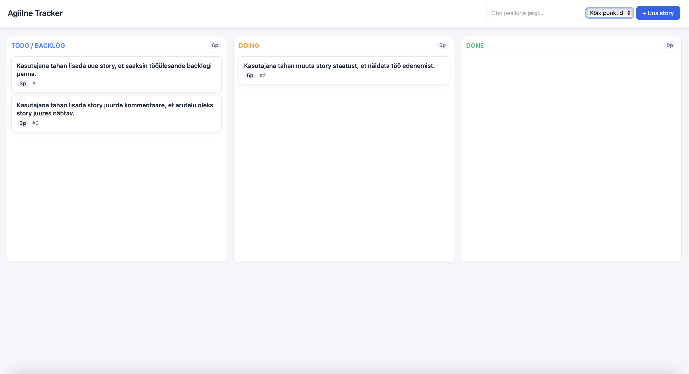
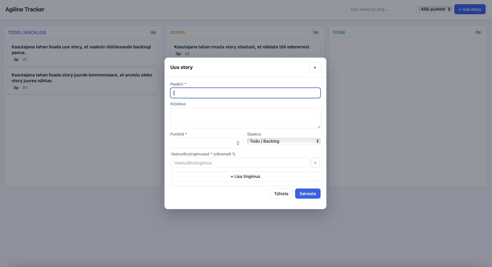
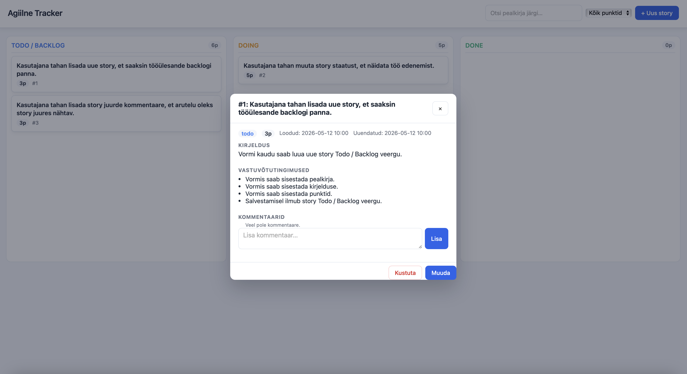

# Urmas — Agile Tracker

Veebirakendus user story'de haldamiseks Kanban-laual (Todo / Doing / Done). Tehtud kooliülesande "Agile Tracker" raames.

## Ekraanipildid

### Kanban-laud



### Story loomise modal



### Story detailvaade ja kommentaarid



---

## 1. Mis tehnoloogiaid kasutasin?

| Kiht | Tehnoloogia |
|------|-------------|
| Backend | Python 3.12 + [FastAPI](https://fastapi.tiangolo.com/) + Pydantic v2 |
| Server | uvicorn |
| Andmehoidla | JSON-fail (`data/stories.json`), atomic-write |
| Frontend | Vanilla HTML + CSS + JavaScript (ei mingeid build-tööriistu) |
| Drag-and-drop | [SortableJS](https://sortablejs.github.io/Sortable/) CDN-ist |
| Testid | pytest + FastAPI TestClient + httpx |

Arhitektuur on **monoliit**: FastAPI serveerib nii REST API endpoint'e (`/api/*`) kui ka staatilist frontendit (`/public`). Käivitub ühe käsuga ühel pordil.

---

## 2. Kuidas rakendus käivitada?

**Eeldused:** Python 3.11 või uuem (testitud 3.12-ga), `git`.

### Kiire käivitus (soovitatud)

```bash
git clone https://github.com/vikk-tak25/urmas-agiilne-tracker.git
cd urmas-agiilne-tracker
./start.sh
```

`start.sh` käitub järgmiselt:

- Loob virtuaalkeskkonna `.venv` (kui puudub) ja installib sõltuvused
- Käivitab uvicorn serveri **taustal** pordile 8000 — terminal jääb vabaks
- Logid lähevad faili `.uvicorn.log`, PID faili `.uvicorn.pid`
- Kordustäitmisel **tapab** vana serveri ja **restardib** uue

Käsureavalikud:

```bash
./start.sh                # või ./start.sh start
./start.sh stop           # peata server
./start.sh restart        # = start (sama loogika)
./start.sh status         # näitab kas server jookseb
PORT=9000 ./start.sh      # teine port
```

### Käsitsi käivitus

```bash
# 1. Klooni repo
git clone https://github.com/vikk-tak25/urmas-agiilne-tracker.git
cd urmas-agiilne-tracker

# 2. Loo virtuaalkeskkond ja installi sõltuvused
python3 -m venv .venv
source .venv/bin/activate           # Windowsil: .venv\Scripts\activate
pip install -r requirements.txt

# 3. Käivita server
uvicorn app.main:app --reload --port 8000
```

### Pärast käivitust ava brauseris

- http://localhost:8000 — Kanban-laud
- http://localhost:8000/docs — Swagger UI (interaktiivne API)

Esimesel käivitusel kopeeritakse `data/stories.example.json` failist 3 näidisstory'd. Kui soovid tühja seisust alustada, kustuta `data/stories.json` enne käivitamist.

### Testide käivitamine

```bash
# Aktiveeri venv kõigepealt (kui pole)
source .venv/bin/activate

# Käivita kõik testid
pytest -v        # API testid

# Või otse ilma aktiveerimata:
.venv/bin/pytest -v
```

---

## 3. Millised funktsioonid valmis said?

### Miinimumnõuded ✅

- Story'de kuvamine Kanban-laual (Todo / Backlog, Doing, Done)
- Mitme projekti haldus: projektide lisamine, muutmine, kustutamine ja vahetamine
- Story lisamine, muutmine, kustutamine (CRUD)
- Story kuulub täpselt ühte projekti ja seda saab muutmisel teise projekti tõsta
- Projekti-põhine story järjenumber (`#1`, `#2`, …) — algab igas projektis 1-st ja on stabiilne
- Story staatuse muutmine (PATCH + drag-and-drop)
- Backlogi järjestamine hiirega lohistades; järjekord säilib pärast lehe uuendamist
- Punktide määramine (täisarv, ≥ 0, vigane sisend → arusaadav veateade)
- Vähemalt 1 vastuvõtutingimus story kohta (kohustuslik)
- Kommentaaride lisamine koos ajatempliga
- Ühe mockupi lisamine story juurde faili valimise, drag-and-dropi või clipboard paste'i abil
- Mockupi asendamine, kustutamine ja suuremas vaates avamine
- Andmete salvestamine JSON-faili
- Täielik REST API (allpool)

### Lisapunktid ✅

- Otsing pealkirja järgi
- Filtreerimine punktide järgi (≥1, ≥3, ≥5, ≥8)
- Punktide summa iga veeru pealkirjas
- Drag-and-drop töötab **kõikide** veergude vahel (mitte ainult backlogis)
- Story detailvaade modalis koos kõikide väljadega ja loomise/muutmise ajaga
- Kommentaaride kustutamine
- HTTP staatusekoodid: 200, 201, 204, 404, 422, 409
- 39 pytest API testi

---

## 4. Millised funktsioonid jäid pooleli?

Kooliülesande miinimum- ja lisanõuded on täidetud. Edasiarendamiseks võimalik:

- Kasutajate autentimine (mitme inimese koos kasutamiseks)
- Story'de prioriteedid ka väljaspool todo-veergu (lihtne lisada)
- Tags/sildid story'de kategoriseerimiseks
- Kommentaaride muutmine (praegu ainult lisamine ja kustutamine)
- Real-time sünk WebSocketi kaudu
- Tagasi-tegemise (undo) funktsioon

---

## 5. Millised olid kõige keerulisemad kohad?

- **Reorder endpointi route'imine**: `PATCH /api/stories/reorder` ja `PATCH /api/stories/{id}/...` võivad konflikti minna, kui FastAPI router lubab `reorder` stringi `story_id` rolli. Lahendus: deklareerida `/reorder` route enne `/{story_id}/...` patterne, et FastAPI ei satuks valele rajale.
- **SortableJS koos rerenderiga**: kogu Kanban-laud rerendreeritakse iga muudatuse järel, kuid Sortable instants on seotud konteineri elemendiga. Iga `renderBoard` kõne säilitab konteineri (asendab vaid `innerHTML`), nii et Sortable jätkab töötamist.
- **Modali paigutus footer-iga**: vorm vajab `submit` nupu olemasolu enda sees (HTML reegel), kuid disainilt peaks Salvesta/Tühista olema visuaalselt eraldatud halli ribana all. Lahendus: vorm omab eraldi `.modal-body` div'i (skrollitav sisu) ja `.modal-footer` rida — sama footer-pattern töötab nii ettedefineeritud vormiga (lisamise modal) kui ka dünaamiliselt täidetud detail-modaliga.
- **Atomic JSON kirjutamine**: kasutusel `.tmp` + `os.replace` + `fsync`, et katkenud kirjutus ei rikuks andmefaili. Lukuga (`threading.Lock`) kaitstud paralleelsete päringute eest.
- **start.sh taustprotsessi haldus**: PID-faili kirjutamine `nohup ... &` kõrval, healthcheck-ootus käivitamise järel, kordustäitmisel graceful SIGTERM → SIGKILL kuni 5s. Kontrollib ka, et eelmine protsess pole zombie (`kill -0`).

---

## REST API endpoint'id

Kõik endpointid on dokumenteeritud Swaggeris: `http://localhost:8000/docs`.

| Meetod | URL | Kirjeldus | Status |
|--------|-----|-----------|--------|
| GET    | `/api/health` | Health check | 200 |
| GET    | `/api/projects` | Kõik projektid | 200 |
| GET    | `/api/projects/{id}` | Üks projekt | 200/404 |
| POST   | `/api/projects` | Loo uus projekt | 201/422 |
| PUT    | `/api/projects/{id}` | Uuenda projekt | 200/404/422 |
| DELETE | `/api/projects/{id}` | Kustuta tühi projekt | 204/404/409 |
| GET    | `/api/stories` | Kõik story'd (sorteeritud) | 200 |
| GET    | `/api/stories?projectId=1` | Valitud projekti story'd | 200/404 |
| GET    | `/api/stories/{id}` | Üks story | 200/404 |
| POST   | `/api/stories` | Loo uus story | 201/422 |
| PUT    | `/api/stories/{id}` | Uuenda story | 200/404/422 |
| DELETE | `/api/stories/{id}` | Kustuta story | 204/404 |
| PATCH  | `/api/stories/{id}/status` | Muuda staatust (`{"status":"doing"}`) | 200/404/422 |
| PATCH  | `/api/stories/reorder` | Salvesta backlogi järjekord (`{"order":[3,1]}`) | 200/404 |
| PUT    | `/api/stories/{id}/mockup` | Lisa või asenda story mockup (`multipart/form-data`) | 200/404/422 |
| DELETE | `/api/stories/{id}/mockup` | Kustuta story mockup | 204/404 |
| POST   | `/api/stories/{id}/comments` | Lisa kommentaar (`{"text":"..."}`) | 201/404/422 |
| DELETE | `/api/stories/{id}/comments/{cid}` | Kustuta kommentaar | 204/404 |

### Näidisandmestruktuur

```json
{
  "id": 1,
  "number": 1,
  "title": "Lisa story loomine",
  "description": "Kasutaja saab luua uue story.",
  "status": "todo",
  "points": 5,
  "projectId": 1,
  "priority": 1,
  "acceptanceCriteria": [
    "Kasutaja saab sisestada pealkirja.",
    "Kasutaja saab sisestada punktid."
  ],
  "comments": [
    { "id": 1, "text": "Seda tuleb testida.", "createdAt": "2026-05-12 14:32" }
  ],
  "mockup": null,
  "createdAt": "2026-05-12 14:00",
  "updatedAt": "2026-05-12 14:32"
}
```

---

## Projekti struktuur

```
urmas-agiilne-tracker/
├── app/
│   ├── __init__.py
│   ├── main.py                    # FastAPI app, staatiline mount, router
│   ├── models.py                  # Pydantic mudelid + validatsioonid
│   ├── storage.py                 # JSON-faili read/write (atomic)
│   └── routes.py                  # /api/stories endpointid
├── data/
│   ├── stories.example.json       # näidisandmed (versioneeritud)
│   ├── projects.example.json      # näidisprojektid (versioneeritud)
│   ├── projects.json              # tegelikud projektid (gitignore'is; luuakse automaatselt)
│   ├── stories.json               # tegelik andmestik (gitignore'is; kopeeritakse esimesel käivitusel example'ist)
│   └── mockups/                   # üleslaetud mockupid (gitignore'is)
├── public/
│   ├── index.html                 # Kanban-laud + modalid
│   ├── style.css                  # disain
│   └── app.js                     # frontend loogika + SortableJS
├── tests/
│   ├── __init__.py
│   └── test_api.py                # API pytest testid
├── docs/
│   ├── screenshot.png             # Kanban-laud
│   ├── screenshot-new-story.png   # Story loomise modal
│   └── screenshot-detail.png      # Story detailvaade
├── start.sh                       # käivitatav skript (käivitab uvicorn taustal)
├── requirements.txt
├── .env.example                   # ENVIRONMENT=development
├── .gitignore
└── README.md
```

---

## Arendusprotsess

Arendus käis vastavalt ülesande nõuetele GitHubi issue'de, feature branchide ja mikrocommitidega:

- Iga funktsiooni kohta on **GitHubi issue** (`gh issue list --state all`)
- Iga issue saab **eraldi feature branchi** (`<issue-id>-lyhi-nimi`)
- Kõik branchid mergitakse `main`-i **squash-merge**'iga
- Iga commit on **mikrocommit** ühe loogilise muudatusega
- Iga commit pushitakse kohe GitHubi
